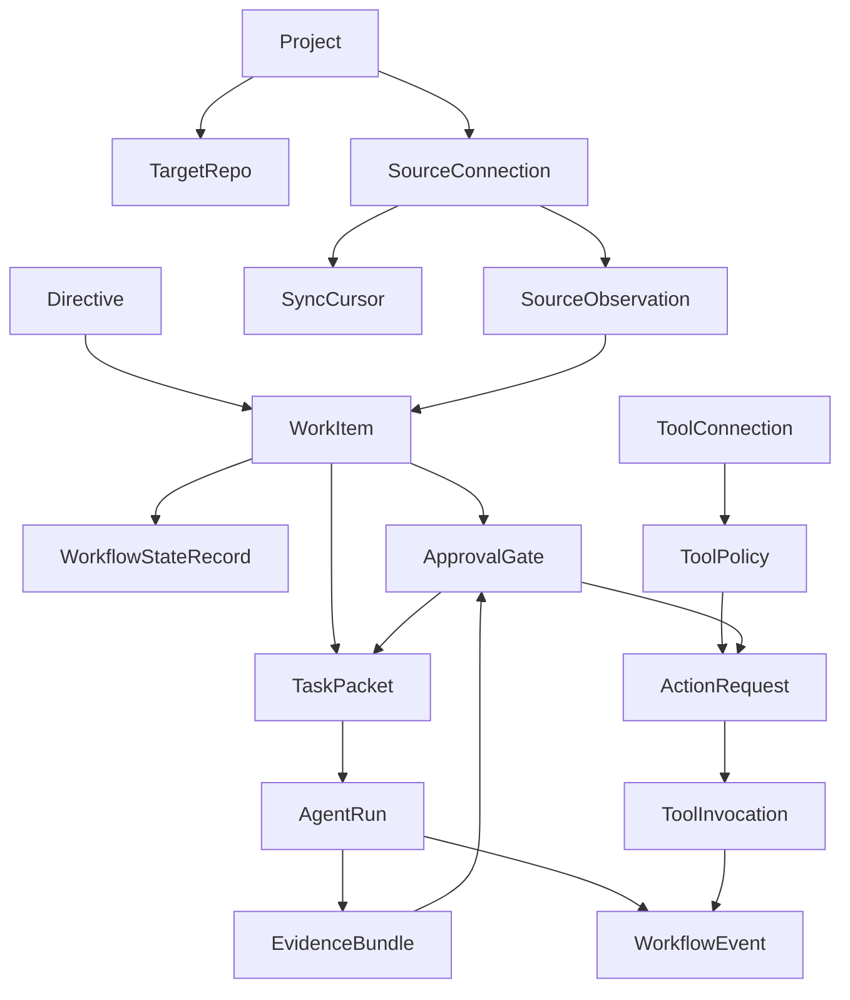

# AntDocs And Development Flow

Hoisa stores its durable workflow state as Antonic `AntDoc` records. These
records are the stable boundary between source systems, workflow selection,
human approval, disposable agent runs, tool control, evidence, and audit
history.

The important design idea is that coding agents receive bounded task packets,
not the whole project memory. Hoisa keeps the wider workflow context in durable
records, passes only the approved slice to a runner, then records compact
evidence and append-only events when the runner finishes.

## AntDoc Inventory

There are 17 Hoisa `AntDoc` collection roots registered in
`DURABLE_RECORD_TYPES`.

| AntDoc | Collection | Purpose | Data it holds |
| --- | --- | --- | --- |
| `Project` | `projects` | Top-level Hoisa project identity. | Name, public-safe summary, provenance, public-safety classification, and redaction status. |
| `TargetRepo` | `target_repos` | Repository that Hoisa can orchestrate work for. | Provider, owner/name, visibility, owning `ProjectRef`, optional default branch, provenance, and public-safety metadata. |
| `SourceConnection` | `source_connections` | Configured external source that Hoisa observes. | Project, source system, display name, status, optional target repo, provenance, and public-safety metadata. |
| `SourceObservation` | `source_observations` | Public-safe normalized fact read from an external source. | Source connection, external ID, content hash, summary, payload schema, scalar payload, provenance, and public-safety metadata. |
| `SyncCursor` | `sync_cursors` | Incremental sync position for a source connection. | Source connection, cursor name, cursor value, provenance, and public-safety metadata. |
| `Directive` | `directives` | Captured human direction before it becomes work. | Project, optional target repo, summary, body, scope constraints, requested review route, risk, provenance, and public-safety metadata. |
| `WorkItem` | `work_items` | Agent-ready unit of workflow. | Type, title, goal, target repo, optional tracker issue, workflow stage, queue status, review route, risk, quality status, plan/PR refs, blockers, evidence refs, provenance, and public-safety metadata. |
| `WorkflowStateRecord` | `workflow_states` | Persisted current-state snapshot for a work item. | Work item ID plus `WorkflowState`, including stage, status, review route, risk, lease, blockers, provenance, and public-safety metadata. |
| `ApprovalGate` | `approval_gates` | Structured human decision object with exact authority. | Gate type/status, work item, stage, risk, recommendation, decision prompt, reason human input is needed, authority granted, options, evidence refs, optional decision, provenance, and public-safety metadata. |
| `TaskPacket` | `task_packets` | Bounded context and authority handed to one disposable agent run. | Work item, stage, target repo, objective, context evidence refs, allowed actions, authority granted, runner profile, budget, evidence requirements, provenance, and public-safety metadata. |
| `AgentRun` | `agent_runs` | Compact execution summary for one disposable runner attempt. | Work item, stage, runner profile, budget, agent identity, run status, start/end time, command summaries, check summaries, evidence refs, provenance, and public-safety metadata. |
| `EvidenceBundle` | `evidence_bundles` | Collection-root package of evidence refs for review or audit. | Subject type/ID, evidence refs, optional provenance, public-safety classification, and redaction status. |
| `WorkflowEvent` | `workflow_events` | Append-only event envelope for audit and retrospective queries. | Event type, timestamp, actor, subject, correlation/causation IDs, stage, risk, payload schema, scalar payload, evidence refs, optional provenance, public-safety classification, and redaction status. |
| `ToolConnection` | `tool_connections` | Current-state record for an external tool integration. | Project, tool type, display name, status, allowed action summaries, provenance, and public-safety metadata. |
| `ToolPolicy` | `tool_policies` | Project policy for one tool action type. | Project, tool type, action type, policy decision, optional required gate type, summary, provenance, and public-safety metadata. |
| `ActionRequest` | `action_requests` | Requested external action recorded before execution authority exists. | Project, tool/action type, status, summary, optional work item, optional tool connection, optional required gate, evidence refs, provenance, and public-safety metadata. |
| `ToolInvocation` | `tool_invocations` | Audited result of an external tool invocation attempt. | Tool/action type, status, timestamp, summary, optional action request, optional tool connection, evidence refs, provenance, and public-safety metadata. |

## Identity And Indexes

Antonic supplies the generic document surface through `insert`, `save`, `get`,
and `find`. Hoisa registers the same durable record types in both the in-memory
test store and the Antonic/Mongo connector.

Several records declare uniqueness rules that preserve stable identities:

| AntDoc | Unique identity |
| --- | --- |
| `TargetRepo` | `provider`, `owner`, and `name`. |
| `SourceObservation` | `source_connection_id`, `external_id`, and `content_hash.value`. |
| `SyncCursor` | `source_connection_id` and `cursor_name`. |
| `WorkItem` | Sparse tracker issue identity: `tracker_issue.provider` and `tracker_issue.issue_number`. |
| `ToolPolicy` | `project.project_id`, `tool_type`, and `action_type`. |

## Model Flow

The records form a workflow pipeline rather than a single nested object graph.



1. `Project` and `TargetRepo` define the public-safe project and repository
   boundary. They intentionally avoid local paths, credentials, or private
   repository content.
2. `SourceConnection`, `SourceObservation`, and `SyncCursor` let Hoisa observe
   external systems incrementally. Observations store reduced summaries,
   content hashes, payload schema names, and scalar payloads so source data can
   be replayed or compared without embedding raw private artifacts.
3. `Directive` captures human intent. A directive can be reduced into one or
   more `WorkItem` records with explicit goal, target repo, risk, review route,
   and quality status.
4. `WorkItem` and `WorkflowStateRecord` are the queue-facing current state.
   Work selection reads stage, status, risk, blockers, and lease data to find
   runnable agent-owned items.
5. `ApprovalGate` pauses only the work item that needs human judgment. It
   records the decision needed, Hoisa's recommendation, available options,
   supporting evidence, and the exact authority that approval would grant.
6. `TaskPacket` is the handoff object for a disposable runner. It carries only
   the objective, workflow stage, target repository identity, context evidence,
   allowed actions, granted authority, runner profile, budget, and expected
   evidence.
7. `AgentRun` records the compact result of the runner. It stores command and
   check summaries, status, timing, budget, runner profile, agent identity, and
   evidence refs, but not raw logs by default.
8. `EvidenceBundle` groups evidence references for review surfaces. The
   evidence refs point at issues, plans, PRs, check runs, repo files, command
   summaries, redacted summaries, or public fixtures.
9. `WorkflowEvent` is the append-only history. It links a typed event to an
   actor, subject, correlation chain, workflow stage, risk, evidence refs, and
   a versioned scalar payload.
10. `ToolConnection`, `ToolPolicy`, `ActionRequest`, and `ToolInvocation`
   represent the tool-control path. Hoisa records policy and requested actions
   before execution, gates actions when needed, then records the invocation
   result for audit.

## Public Schemas

The public schema catalog currently exposes the boundary records that external
surfaces are expected to render or exchange:

- `Directive`
- `WorkItem`
- `ApprovalGate`
- `TaskPacket`
- `AgentRun`
- `EvidenceBundle`
- `WorkflowEvent`

Source, repository, workflow-state, and tool-control records are still durable
AntDocs, but they are not yet part of the public schema catalog.

## Current Implementation Status

The durable model and persistence boundary are implemented. Both the in-memory
store and the Antonic/Mongo connector register all 17 durable record types, and
the persistence port exposes generic AntDoc CRUD plus workflow-specific queries
for runnable work, waiting gates, leases, tool policies, tool invocations, and
event history.

Several parts of the model flow are intentionally ahead of the operational
orchestrator:

- The active GitHub helper still derives tracker facts into
  `SelectableWorkItem` values for pure selection logic; it does not yet reduce
  tracker data into persisted `WorkItem` and `WorkflowStateRecord` records for
  the full loop.
- `Directive` is modeled and public-schema'd, but there is not yet an active
  reducer that turns directives into work items.
- `SourceObservation` and `SyncCursor` are modeled, but source sync/reduction
  is not yet implemented behind `ports/source_sync.py`.
- `TaskPacket` rendering exists, but the Docker POC is not yet wired to packet
  creation, work selection, gates, PR creation, checks, or a production runner
  port.
- Tool-control records are durable and queryable, but policy enforcement and
  external action execution are not yet implemented behind
  `ports/external_action.py`.
- `WorkflowEventType` defines the broader intended event vocabulary; durable
  append is currently exercised by persistence tests and the Docker POC.

## Runner Boundary

The process layer owns workflow context and authority. It chooses or receives
the approved work item, builds a bounded `TaskPacket`, decides runner profile
and budget, grants allowed actions, defines expected evidence, persists compact
run summaries, records private raw output when needed, appends workflow events,
and transitions work after evidence exists.

The coding runner receives only the rendered task-packet fields. It should not
need to understand GitHub Project fields, issue queue selection, approval gate
mechanics, helper commands, raw runner payloads, or broader planning history.

The handoff renderer in `hoisa.app.services.coding_handoff` copies only
task-packet fields into a deterministic prompt:

- task identity;
- objective;
- workflow stage;
- target repository identity;
- runner profile and budget;
- context references;
- allowed actions and exact authority;
- expected evidence;
- runner boundary.

After the runner returns, fixed logic can persist compact `AgentRun` summaries,
group review evidence in `EvidenceBundle`, and append `WorkflowEvent` records.
LLM-assisted process judgment may summarize a run or recommend a next
transition, but the durable records are the source of truth.

## Current Docker POC Slice

The local Docker Codex POC uses this same split. It proves that a Dockerized
Codex command can produce a raw process result while Hoisa stores a compact run
summary separately from private raw output.

The script records two durable facts:

- `AgentRun` stores the compact run summary: runner profile, budget, agent
  identity, status, timestamps, and command summary.
- `WorkflowEvent.payload` stores the private raw process result: stdout,
  stderr, exit code, image, command, network mode, timeout, and timestamps.

The raw event uses this versioned payload schema:

```text
poc.docker_agent.raw_result.v1
```

The schema name is deliberately POC-scoped. Future stable runner work can
define a durable runner result schema after the first local loop proves the
shape it needs.

## Public/Private Boundary

Hoisa is public, while target repositories may be private. Public docs, tests,
schemas, fixtures, plans, issues, PRs, and support notes should use generic
or redacted examples. Private target-repo content, local paths, credentials,
raw logs, screenshots, and business-specific plans belong in the target
repositories or private event payloads, not in public Hoisa artifacts.
