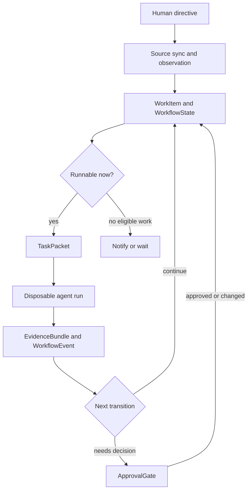

# AntDocs And Development Flow

This note explains the intended Hoisa development loop and the durable Antonic
documents that support it. It describes the target architecture: some pieces
exist today, and some are the shape the current records are designed to enable.

## The Development Loop

Hoisa sits one level above coding agents. A developer does not ask one agent to
"own the whole project." Instead, the developer defines a project, connects one
or more repositories and sources, sets policy boundaries, and then feeds Hoisa
direction. Hoisa turns that direction into small work items, routes eligible
items to disposable agents, pauses only the items that need human judgment, and
keeps moving on everything else.

In the complete system, a normal development cycle looks like this:

1. A human creates or updates a project directive: a goal, constraints,
   out-of-scope boundaries, and checks that matter.
2. Hoisa syncs external sources such as GitHub issues, PRs, comments, reviews,
   and later Slack or other channels.
3. Source observations are reduced into Hoisa-owned work items and workflow
   state. The tracker remains visible, but Hoisa owns the lifecycle metadata.
4. The loop selects a runnable work item whose workflow stage, status, risk,
   blockers, and lease state make it eligible.
5. Hoisa creates a bounded task packet: objective, context references, allowed
   actions, runner profile, budget, and required evidence.
6. A fresh agent runs in a disposable runner such as a Dockerized Codex CLI.
7. The run emits summaries, evidence references, and workflow events. Raw
   runner output can be stored as private event payloads, while review surfaces
   use compact summaries by default.
8. Hoisa transitions the item. It may create a plan, request review, open a
   gate, implement code, open a PR, respond to review, or mark the work done.
9. If a human decision is needed, Hoisa creates an approval gate with exact
   authority. That item waits; unrelated runnable work continues.
10. Over time, workflow events become a dataset for retrospectives. Hoisa can
    propose workflow changes, new issues, stricter policies, or updated skills.

## What A Developer Defines First

A developer should not need to hand-author every database record. The intended
user-facing setup should be small, with Hoisa creating most records from
configuration, source sync, and directives.

At project setup, the developer defines:

- Project identity: name, purpose, and privacy posture.
- Target repositories: provider, owner/name, default branch, and visibility.
- Source connections: which systems Hoisa observes, such as GitHub issues and
  PRs.
- Tool connections: which tools Hoisa may invoke, such as GitHub mutations,
  runner backends, notification channels, or local worktree operations.
- Tool policies: which actions are allowed, denied, or require gates.
- Runner profiles: which agent runtime to use for planning, implementation,
  review, CI repair, and retrospective work.
- Workflow defaults: review route, risk defaults, lease length, required checks,
  and issue quality rules.
- Human decision channels: where gates are rendered and how decisions return to
  Hoisa.

After setup, the developer mostly creates direction:

- "Build this product area."
- "Break this roadmap into issues."
- "Keep working through approved implementation tasks."
- "Review what got stuck last week and suggest improvements."

Hoisa converts that direction into durable work, plans, gates, PRs, and
retrospective follow-ups.

## How Agents Get Tasks

Agents do not poll GitHub directly and invent their own scope. Hoisa gives each
agent a bounded task packet.

The selection loop uses Hoisa state:

- `WorkItem.workflow_stage` and `WorkflowStateRecord.state.stage` say which
  workflow stage the item is in.
- `status`, blockers, and leases say whether the item is available.
- `risk` and `review_route` decide how much review and gating are needed.
- `ToolPolicy` decides whether requested external actions are allowed, denied,
  or gate-backed.

Once an item is selected, Hoisa creates a `TaskPacket` with only the relevant
context and authority. The runner receives that packet, runs one stage, and
returns results. The run is recorded as an `AgentRun`; detailed audit facts are
recorded as `WorkflowEvent`; reviewable artifacts are referenced through
`EvidenceBundle`.

This keeps agents disposable. If an implementer gets confused, a reviewer or
fresh implementer can start from the task packet, evidence, and repo state
without trusting the previous chat transcript.

## How The Repo Gets Shape Over Time

The repository changes through normal software artifacts:

- Issues hold task substance and user-facing coordination.
- Project metadata holds queue state, workflow stage, risk, review route, and
  gate state.
- Plan files under `docs/agent-plans/` capture durable implementation plans.
- Pull requests carry implementation diffs, review discussion, and checks.
- Hoisa records runs, events, evidence, gates, and tool actions in the database.
- Retrospectives read workflow history and create new directives or work items.

The repo gets shape by repeatedly moving small items through plan, review,
approval, implementation, verification, and merge-readiness. Human approval is
single-use and scoped. A plan approval authorizes only that plan; it does not
grant blanket permission for secrets, production actions, or unrelated work.

## AntDocs In Hoisa

AntDocs are Hoisa's collection-root persistence records. In MongoDB, Antonic
stores the domain `id` as Mongo `_id`; embedded value objects are normal
Pydantic models, not their own collections.

Most AntDocs fall into one of five buckets:

- Setup records: durable project, repository, source, and tool configuration.
- Source records: what Hoisa observed from outside systems and where sync left
  off.
- Workflow current state: the current work queue and decision objects.
- Execution records: task packets, runs, evidence, tool requests, and tool
  invocations.
- History records: append-only workflow events used for audit and
  retrospectives.

### Project And Repository Records

| AntDoc | Collection | Purpose |
| --- | --- | --- |
| `Project` | `projects` | The top-level Hoisa project. Groups repositories, sources, policies, and workflow history under one product or initiative. |
| `TargetRepo` | `target_repos` | A repository Hoisa can coordinate. Stores provider identity, visibility, default branch, and project reference without local paths or secrets. |

### Human Direction

| AntDoc | Collection | Purpose |
| --- | --- | --- |
| `Directive` | `directives` | Captured human direction before it becomes executable work. Holds the summary, body, scope constraints, requested review route, and risk. |

### Source Sync

| AntDoc | Collection | Purpose |
| --- | --- | --- |
| `SourceConnection` | `source_connections` | A configured external source Hoisa observes, such as GitHub for a target repo. |
| `SourceObservation` | `source_observations` | A public-safe observed source snapshot or summary. It has an external id, content hash, schema name, and small scalar payload. |
| `SyncCursor` | `sync_cursors` | Incremental sync position for a source connection, so repeated syncs are deterministic. |

### Work Queue And Gates

| AntDoc | Collection | Purpose |
| --- | --- | --- |
| `WorkItem` | `work_items` | The agent-ready unit of work. It contains goal, target repo, tracker issue reference, stage, status, risk, review route, plan/PR refs, blockers, and evidence refs. |
| `WorkflowStateRecord` | `workflow_states` | Hoisa-owned current state for a work item: stage, queue status, review route, risk, lease, and active blockers. This lets Hoisa select work without trusting issue body text. |
| `ApprovalGate` | `approval_gates` | A structured human decision request. It states the decision needed, recommendation, risk, evidence, exact authority granted, allowed choices, and final decision. |

### Agent Execution

| AntDoc | Collection | Purpose |
| --- | --- | --- |
| `TaskPacket` | `task_packets` | The bounded packet sent to one disposable agent run. It contains objective, context refs, allowed actions, authority, runner profile, budget, and evidence requirements. |
| `AgentRun` | `agent_runs` | A compact record of one disposable agent attempt. It stores runner profile, budget, agent identity, status, timestamps, command summaries, check summaries, and evidence refs. It intentionally does not store full logs by default. |
| `EvidenceBundle` | `evidence_bundles` | A collection-root bundle of evidence references for review and audit. It points to plans, PRs, checks, command summaries, or redacted summaries without embedding raw artifacts. |

### Tool Control

| AntDoc | Collection | Purpose |
| --- | --- | --- |
| `ToolConnection` | `tool_connections` | A configured integration Hoisa may use, such as GitHub, a runner backend, or a notification surface. |
| `ToolPolicy` | `tool_policies` | A per-project policy for a tool action type. It says allow, deny, or require a gate before the action can proceed. |
| `ActionRequest` | `action_requests` | A requested external action recorded before execution authority exists. It links to work item, tool connection, required gate, and evidence. |
| `ToolInvocation` | `tool_invocations` | The audited result of attempting a tool action: succeeded, failed, denied, or skipped. |

### Workflow History

| AntDoc | Collection | Purpose |
| --- | --- | --- |
| `WorkflowEvent` | `workflow_events` | Append-only event envelope for audit, causation, and retrospectives. It records event type, actor, subject, correlation id, stage, risk, public-safety class, payload schema, scalar payload, and evidence refs. |

`WorkflowEvent` is also the right current place for raw POC runner payloads
when the payload is private and not meant for public review surfaces. For
example, a Dockerized Codex run can create an `AgentRun` summary and a paired
`WorkflowEvent` with `payload_schema = "poc.docker_agent.raw_result.v1"` whose
payload contains stdout, stderr, exit code, image, command, and timestamps.

## Record Relationships

Common links:

- `Project.id` -> `TargetRepo.project.project_id`
- `TargetRepo.id` -> `WorkItem.target_repo.target_repo_id`
- `Directive.project.project_id` -> generated `WorkItem` records
- `SourceConnection.id` -> `SourceObservation.source_connection_id`
- `SourceConnection.id` -> `SyncCursor.source_connection_id`
- `WorkItem.id` -> `WorkflowStateRecord.work_item_id`
- `WorkItem.id` -> `ApprovalGate.work_item_id`
- `WorkItem.id` -> `TaskPacket.work_item_id`
- `WorkItem.id` -> `AgentRun.work_item_id`
- `AgentRun.id` -> `WorkflowEvent.subject.subject_id` for run events
- `ApprovalGate.id` -> `ActionRequest.required_gate_id` when a tool action is
  gate-backed
- `ActionRequest.id` -> `ToolInvocation.action_request_id`
- `EvidenceRef` values link reviewable records to plans, PRs, checks, command
  summaries, and redacted artifacts

The important design choice is that issue text, PR comments, and agent chats are
not the authoritative state machine. They are sources, evidence, or user-facing
surfaces. Hoisa's durable state is the AntDoc graph plus tracker metadata.

## Why This Shape Matters

This model gives Hoisa a stable control plane:

- A human can understand and approve small gate cards instead of reading full
  transcripts.
- Agents receive bounded packets instead of whole-repo memory dumps.
- Raw output can be kept private while summaries and evidence refs remain
  reviewable.
- Reviewers can use fresh context because plans, evidence, events, and PRs are
  durable.
- The system can keep working when one item waits on a human.
- Workflow history can be mined for better policies, issue quality rules,
  runner profiles, and skills.
