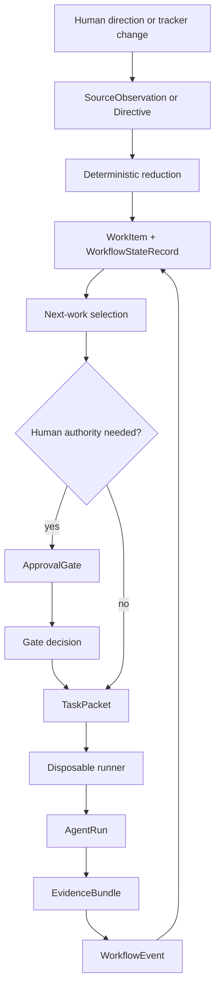

# Hoisa Current State And Roadmap

Date: 2026-06-23

Status: public planning document. `docs/vision.md` remains the canonical product
vision.

## Purpose

This document is a bridge between the vision and the next useful product work.
It should answer three questions:

1. What is true about Hoisa today?
2. What first product slice would prove the thesis?
3. Which task-shaped roadmap items should move the repo toward that slice?

It is not a full component inventory, a market landscape, a replacement for
`docs/github-workflow.md`, or a promise that early command names and schemas are
stable. Early product surfaces may be renamed or deleted when that makes the
first working loop clearer.

## North Star

Hoisa is not another coding agent. Hoisa is the project operating layer around
agents.

The intended loop is:

1. Humans provide direction and priorities.
2. Hoisa turns that direction into durable work state, bounded agent steps, and
   exact human gates.
3. Agents execute disposable, packet-sized work.
4. Hoisa records evidence, checks, gates, decisions, and transitions outside the
   agent conversation.
5. Human waits pause only the gated item; other eligible work can continue.
6. Hoisa studies its workflow history and improves itself through the same
   governed process.

The first consumer is Hoisa itself, but the design must stay generic enough for
other repositories and other agent work shapes later.

## Current Truth

Hoisa is still pre-alpha. It has strong foundations, but it does not yet have an
integrated product loop that syncs tracker state, creates task packets, runs
agents, records evidence, waits on gates, and continues elsewhere.

What exists today:

| Area | Reality | Useful files |
| --- | --- | --- |
| Product direction | The repo has a clear vision: repo-native orchestration, metadata-backed gates, bounded agent runs, evidence, and retrospectives. | `docs/vision.md`, `README.md` |
| Contributor workflow | Hoisa is currently built through a GitHub-assisted contributor workflow. This is operational tooling for this repo, not the product runtime. | `docs/github-workflow.md`, `scripts/github/agent_workflow.py`, `.agents/skills/` |
| Durable records | The core nouns exist as typed domain records: directives, work items, workflow state, gates, task packets, runs, evidence, source observations, tool-control records, and events. | `src/hoisa/domain/` |
| Pure workflow policy | Stage transitions, next-work selection, and issue quality/risk/trust checks are implemented as testable services. | `src/hoisa/domain/workflow_transitions.py`, `src/hoisa/app/workflows/select_next_work.py`, `src/hoisa/app/services/issue_quality.py` |
| Persistence | Hoisa has a persistence port, workflow query helpers, an in-memory adapter, and an Antonic/Mongo adapter. | `src/hoisa/ports/persistence.py`, `src/hoisa/adapters/persistence/` |
| Local DB bootstrap | A fresh local MongoDB can be reinitialized from ignored local config and seeded with GitHub repository issue connection records. | `deploy/local/README.md`, `scripts/github/bootstrap_connection.py` |
| GitHub repo issue connection | The bootstrap validates GitHub App repository metadata and issue read access, then stores `TargetRepo`, `SourceConnection`, `SyncCursor`, `ToolConnection`, and `ToolPolicy` records. A follow-up sync imports non-PR repository issues into source observations, work items, workflow states, and a source-sync event. | `src/hoisa/app/services/github_connection_bootstrap.py`, `src/hoisa/app/services/github_issue_sync.py`, `scripts/github/sync_issues.py` |
| DB inspection | Codex sessions can inspect the local Hoisa database through a read-only MongoDB MCP server named `mongodb_hoisa_local` when the user-level MCP config is loaded. | `deploy/local/README.md` |
| Public schemas | Seven public boundary records have JSON schemas and fixtures. | `src/hoisa/schemas/public/`, `tests/fixtures/public/` |
| Coding handoff | A `TaskPacket` can be rendered into deterministic coding-runner input. | `src/hoisa/app/services/coding_handoff.py` |
| Runner proof of concept | A local Docker POC can run one command and persist compact `AgentRun` evidence plus private raw output in a `WorkflowEvent`. | `scripts/poc_docker_agent_run.py`, `deploy/local/` |
| Tests | The repo already checks architecture boundaries, workflow policy, issue quality, schemas, persistence behavior, helper behavior, and the Docker POC. | `tests/`, `.github/workflows/ci.yml` |

What does not exist yet:

- no app-level orchestrator that composes sync, selection, gates, packet
  creation, runner execution, evidence, and transitions;
- no real approval-gate lifecycle service with persisted creation, rendering,
  decision, invalidation, and audit behavior;
- no runner port implementation behind the Docker POC;
- no product CLI or service loop; the current operational commands live in
  repo-local scripts;
- no status surface that answers "what needs me?", "what is running?", and
  "what got stuck?" from Hoisa-owned state.

The roadmap should protect this distinction: the GitHub helper is valuable
evidence about workflow needs, but the product runtime should live in package
services, ports, adapters, records, and tests.

## Boundary Model

The product boundary should stay simple:

The runner should receive only the approved packet. It should not own tracker
routing, approval mechanics, broad project memory, raw private logs, or
authority to mutate workflow state.

The human should receive only the gate or status view needed for the decision.
They should not need to reconstruct the project from agent transcripts.

## External Design Pressure

The ecosystem is converging on the same primitives Hoisa already points toward:
durable state, async work, tool boundaries, human approvals, and traceable runs.
These are pressure tests, not product requirements to copy.

- [GitHub Copilot cloud agent](https://docs.github.com/en/copilot/concepts/agents/cloud-agent/about-cloud-agent)
  validates GitHub issues, branches, draft PRs, and review handoff as a natural
  first coordination surface for coding agents.
- [Model Context Protocol architecture](https://modelcontextprotocol.io/docs/learn/architecture)
  separates tools, resources, prompts, capability discovery, transports, and
  notifications. Hoisa should keep context and tool authority explicit instead
  of hiding them in prompts.
- [LangGraph interrupts](https://docs.langchain.com/oss/python/langgraph/interrupts)
  and persistence show the same durable pause/resume shape that Hoisa needs for
  gates.
- [OpenAI Agents SDK human-in-the-loop](https://openai.github.io/openai-agents-python/human_in_the_loop/)
  shows approval interruptions and resumable run state as first-class agent
  runtime concerns.
- [OpenAI Agents SDK guardrails](https://openai.github.io/openai-agents-python/guardrails/)
  and [tracing](https://openai.github.io/openai-agents-python/tracing/) reinforce
  that checks, tool-call boundaries, and run history need durable surfaces.

Hoisa's choice is to make those primitives repo-native and project-governed:
tracker state, gates, packets, evidence, and workflow events should be durable
records that can outlive any one agent session or runner vendor.

## First Useful Product Slice

The first useful slice is not a dashboard, voice interface, or fully autonomous
daemon. It is a single-repo, one-issue, manual-assisted loop that proves Hoisa's
coordination value.

The slice should do this:

1. Read one tracker item and related public-safe metadata.
2. Store a source observation and reduce it into canonical work state.
3. Evaluate issue quality, risk, and trust.
4. Select the next agent-owned step or explain why no step is runnable.
5. Create and render one exact human gate when authority is needed.
6. After approval, create a bounded task packet.
7. Run one local bounded coding attempt through a runner port.
8. Persist compact run evidence and private raw output separately.
9. Transition the work item from durable state and evidence.
10. Show a status summary: active work, waiting gates, stale leases, blockers,
    latest evidence, and the next human decision if any.

The demo is successful when a human can say: "I know what Hoisa did, what it is
allowed to do next, what evidence supports that, and whether I am needed."

## Roadmap Principles

- Build the narrow loop before broad autonomy.
- Keep contributor tooling and product runtime separate.
- Treat issue, PR, review, and comment text as untrusted task input.
- Store mutable lifecycle state in records and tracker metadata, not prose.
- Give runners packets, not whole-repo memory.
- Make approvals exact, single-use, evidence-backed, and revocable when evidence
  changes.
- Record enough event history to audit and improve the process.
- Keep public Hoisa artifacts generic; private target-repo content, raw logs,
  local paths, credentials, and domain-specific plans stay out of this repo.

## Roadmap

### Phase 1: Canonical Intake

Goal: make Hoisa state real before running agents.

**Task 1.1: Read-only source sync**

- Goal: read repository issues from a configured GitHub repo connection into
  `SourceObservation` and `SyncCursor` records.
- Likely files: `src/hoisa/ports/source_sync.py`, `src/hoisa/domain/sources.py`,
  `src/hoisa/adapters/`, `tests/unit/adapters/`.
- Acceptance: sync is read-only, idempotent, content-hashed, cursor-backed, and
  tested with fake clients.
- Out of scope: tracker mutation, runner execution, importing the repo-local
  helper as product code.
- Checks: full repo checks plus focused adapter tests.
- Risk and review route: high risk, review both plan and implementation.

**Task 1.2: Observation-to-work reducer**

- Goal: reduce source observations and directives into `WorkItem`,
  `WorkflowStateRecord`, evidence refs, blockers, risk, review route, and
  quality status.
- Likely files: `src/hoisa/app/services/`, `src/hoisa/domain/work_items.py`,
  `src/hoisa/domain/workflow_state.py`, `src/hoisa/app/services/issue_quality.py`.
- Acceptance: reducer is deterministic, fixture-driven, and side-effect-free.
- Out of scope: gates, runners, comments, continuous loops.
- Checks: full repo checks plus fixture integration tests.
- Risk and review route: medium risk, review both.

**Task 1.3: Minimal work-step shape spike**

- Goal: decide whether the first loop needs a new `WorkStep` or can use current
  workflow state plus task packets until the loop proves itself.
- Likely files: `docs/vision.md`, `docs/architecture/antdocs-and-development-flow.md`,
  `src/hoisa/domain/task_packets.py`, `src/hoisa/domain/gates.py`,
  `src/hoisa/domain/runs.py`, `src/hoisa/domain/evidence.py`.
- Acceptance: recommendation with rejected alternatives, invariants, and
  follow-up implementation tasks.
- Out of scope: implementing a full graph framework.
- Checks: docs/spike review.
- Risk and review route: medium risk, review plan.

### Phase 2: Human Gates

Goal: turn human approval into durable product state instead of comment parsing.

**Task 2.1: Gate lifecycle service**

- Goal: create, render, decide, and audit approval gates from canonical work
  state and evidence.
- Likely files: `src/hoisa/domain/gates.py`, `src/hoisa/domain/events.py`,
  `src/hoisa/ports/persistence.py`, new app service tests.
- Acceptance: gate card includes decision needed, why now, recommendation, risk,
  exact authority, options, and evidence refs; decisions are single-use.
- Out of scope: dashboards, voice, mobile notifications, broad automation.
- Checks: full repo checks plus gate lifecycle tests.
- Risk and review route: high risk, review both.

**Task 2.2: Gate invalidation and safety**

- Goal: mark gates stale when evidence, plan refs, risk, or authority changes,
  and keep public gate artifacts free of private material.
- Likely files: `src/hoisa/domain/privacy.py`, `src/hoisa/domain/provenance.py`,
  `src/hoisa/domain/evidence.py`, `src/hoisa/schemas/public/`,
  `tests/unit/schemas/`.
- Acceptance: stale evidence blocks old approvals; public fixtures cite refs and
  summaries, not raw logs or private target-repo content.
- Out of scope: private storage encryption and retention policy.
- Checks: full repo checks plus schema safety tests.
- Risk and review route: high risk, review both.

### Phase 3: Bounded Execution

Goal: hand one approved packet to one disposable runner and record what happened.

**Task 3.1: Task packet builder**

- Goal: build approved `TaskPacket` records from work state, gate decisions, risk
  policy, context refs, runner profile, budget, and expected evidence.
- Likely files: `src/hoisa/domain/task_packets.py`,
  `src/hoisa/app/services/coding_handoff.py`, new app service tests.
- Acceptance: packets include exact authority and exclude workflow-control
  internals, raw logs, secrets, local paths, and unrelated repo memory.
- Out of scope: executing the packet or writing tracker comments.
- Checks: full repo checks plus prompt exclusion tests.
- Risk and review route: medium risk, review both.

**Task 3.2: Runner port and Docker adapter**

- Goal: turn the Docker Codex POC into a real runner adapter behind
  `ports/runner.py`.
- Likely files: `src/hoisa/ports/runner.py`, `src/hoisa/adapters/runner/`,
  `scripts/poc_docker_agent_run.py`, `deploy/local/`,
  `tests/unit/scripts/test_poc_docker_agent_run.py`.
- Acceptance: one packet can run with explicit image, network, mounts, env,
  timeout, and working directory; result maps to compact `AgentRun`, evidence,
  and private raw `WorkflowEvent`.
- Out of scope: hosted runners, production credentials, daemon operation.
- Checks: full repo checks plus local smoke when Docker/Mongo are available.
- Risk and review route: high risk, review both.

**Task 3.3: Evidence and transition composer**

- Goal: compose runner results, checks, evidence bundles, and transition
  decisions into one deterministic post-run update.
- Likely files: `src/hoisa/domain/workflow_transitions.py`,
  `src/hoisa/domain/events.py`, `src/hoisa/domain/evidence.py`,
  `src/hoisa/app/services/`.
- Acceptance: success, failure, timeout, missing evidence, and check failure each
  produce explicit events and next states.
- Out of scope: automatic repair loops and tracker mutation.
- Checks: full repo checks plus fixture-driven transition tests.
- Risk and review route: medium risk, review both.

### Phase 4: First Loop

Goal: compose the pieces into one command that proves the product thesis for one
issue.

**Task 4.1: `loop --once --dry-run`**

- Goal: run sync, reduction, quality/risk/trust evaluation, selection, gate
  planning, and status without executing a runner or mutating trackers.
- Likely files: `src/hoisa/cli/`, `src/hoisa/app/workflows/`,
  `src/hoisa/ports/persistence.py`, tests.
- Acceptance: dry-run output explains selected work, skipped work, waiting gates,
  blockers, and the next required human decision.
- Out of scope: runner execution, tracker mutation, continuous daemon.
- Checks: full repo checks plus CLI fixture tests.
- Risk and review route: medium risk, review both.

**Task 4.2: `loop --once` local execution**

- Goal: after a valid approval gate, create a task packet, run the local runner,
  persist evidence, and transition the work item.
- Likely files: same as Task 4.1 plus runner adapter and evidence services.
- Acceptance: one approved issue advances through packet, run, evidence, event,
  and next state with no raw private output in public summaries.
- Out of scope: multiple concurrent issues, hosted execution, auto merge.
- Checks: full repo checks plus local integration smoke when dependencies are
  available.
- Risk and review route: high risk, review both.

**Task 4.3: Status view**

- Goal: answer what is active, waiting on humans, blocked, stale, or recently
  completed from Hoisa-owned state.
- Likely files: `src/hoisa/ports/persistence.py`, `src/hoisa/domain/events.py`,
  `src/hoisa/app/services/`, `src/hoisa/cli/`.
- Acceptance: status includes active leases, expired leases, waiting gates,
  blockers, latest evidence, and concise next actions.
- Out of scope: web dashboard, notifications, retrospectives.
- Checks: full repo checks plus fake-clock/status tests.
- Risk and review route: medium risk, review both.

### Phase 5: Continuous Operation And Learning

Goal: move from a trustworthy one-issue lane to a loop that can keep working.

**Task 5.1: Continuous loop supervisor**

- Goal: repeatedly sync, apply gate decisions, reset or report stale leases,
  select eligible work, dispatch steps, record evidence, and wait quietly when
  only human-gated work remains.
- Likely files: `src/hoisa/app/workflows/`, `src/hoisa/ports/clock.py`,
  `src/hoisa/ports/notifier.py`, source-sync, runner, tracker, and persistence
  ports.
- Acceptance: loop can be stopped cleanly; gated items do not block unrelated
  runnable work; fake-clock tests cover wait, retry, and stale-lease paths.
- Out of scope: production deployment, mobile/voice/Slack, auto merge.
- Checks: full repo checks plus supervisor tests.
- Risk and review route: high risk, review both.

**Task 5.2: Workflow retrospectives**

- Goal: query workflow history and propose process improvements as normal Hoisa
  work.
- Likely files: `src/hoisa/domain/events.py`, persistence queries, new
  retrospective service, docs.
- Acceptance: retrospective report identifies stuck work, noisy gates, useful
  review routes, repeated check failures, missing evidence, and candidate
  follow-up issues.
- Out of scope: automatically changing policy or creating issues without
  approval.
- Checks: full repo checks plus fixture history tests.
- Risk and review route: medium risk, review both.

**Task 5.3: General work-shape model**

- Goal: after the coding lane works, generalize planning, review, repair,
  research, and retrospective steps into reusable work shapes.
- Likely files: domain records, public schemas, app workflow services, docs.
- Acceptance: the coding loop becomes one preset graph; other work shapes can
  define inputs, outputs, authority, evidence, and gate policy without changing
  the runner contract.
- Out of scope: visual workflow builder, marketplace, arbitrary user scripts.
- Checks: full repo checks plus schema and graph fixture tests.
- Risk and review route: medium risk, review both.

## Useful Non-Goals

Do not lead with these:

- dashboard-first development;
- voice or mobile approval channels;
- autonomous merge;
- broad multi-repo scheduling;
- broad tool-hosting platform work;
- private pilot details;
- raw terminal streaming as the main product surface;
- a generic graph framework before the one-issue coding lane proves the
  needed contracts.

Each of those may become valuable later. None is required to prove that Hoisa
can reduce human babysitting while keeping authority, evidence, and state
durable.

## Success Measures

The roadmap should be judged by operating outcomes, not by how many components
exist.

- Human attention: fewer ad hoc status questions, fewer transcript reads, more
  decisions made from gate cards.
- Agent focus: smaller packets, clearer authority, less unrelated context.
- Safety: no private target-repo content in public artifacts; privileged tool
  actions stay policy-checked and audited.
- Throughput: eligible work continues while unrelated items wait for humans.
- Quality: fewer implementation rewrites caused by vague issues, missing plans,
  weak evidence, or unvalidated check failures.
- Learnability: workflow events make it possible to ask which gates, reviews,
  runners, and task shapes actually helped.

The first milestone is not "Hoisa is autonomous." The first milestone is more
modest and more important: Hoisa can take one approved issue through durable
state, exact authority, bounded execution, evidence, and a clear next decision.
