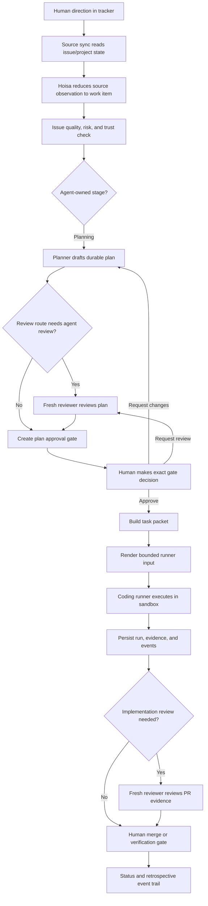

# Hoisa Current State And Useful Roadmap

Date: 2026-06-21

This document summarizes what Hoisa can do today, proposes a simple end-to-end
development flow that demonstrates real value, and suggests the big tasks that
would turn the project from a strong skeleton into a useful operating system for
human-agent software work.

It assumes no backward compatibility requirement. Existing public schemas,
helper commands, field names, and local POC interfaces can be changed, renamed,
or deleted when doing so makes the first useful system simpler. The important
constraint is not compatibility with early artifacts; it is preserving the
product thesis in `docs/vision.md`: durable project state, bounded agent work,
minimal human gates, public/private safety, and evidence-backed decisions.

## Short Version

Hoisa is not operational yet. It cannot currently run a continuous loop that
syncs work, creates task packets, dispatches runners, waits on gates, and
continues elsewhere.

It does have the right bones:

- a clear product vision and GitHub workflow contract;
- domain records for directives, work items, workflow state, gates, task
  packets, runs, evidence, source observations, tool policy, and events;
- pure services for workflow transitions, next-work selection, issue quality,
  and task-packet rendering;
- public JSON schemas and fixtures for the core boundary records;
- persistence contracts plus in-memory and Antonic/Mongo-backed storage;
- a large GitHub helper script that acts as today's temporary workflow engine;
- a Docker Codex POC that can run one bounded local command and persist compact
  run evidence plus private raw output;
- tests that encode many of the important human/agent boundaries.

The smallest valuable demo should not be a dashboard or a fully autonomous
runner. It should be a single-repo, manual-assisted Hoisa loop:

1. read a well-formed GitHub issue;
2. assess readiness, risk, and trust;
3. create or accept a plan;
4. present one exact human approval gate;
5. render an approved task packet;
6. run one bounded coding-agent attempt;
7. persist compact evidence and private raw output;
8. open or hand off a PR;
9. show a status summary that explains what happened and what human decision is
   still needed.

That flow would demonstrate Hoisa's real value: the human does not babysit an
agent chat. The human gives direction, approves exact authority when needed, and
reviews evidence. Hoisa owns the boring coordination layer between those moments.

## Current Component Deep Dive

### Product And Workflow Docs

Existing files:

- `docs/vision.md`
- `docs/github-workflow.md`
- `docs/research/human-agent-project-orchestration.md`
- `docs/architecture/antdocs-and-development-flow.md`
- `AGENTS.md`
- `CONTRIBUTING.md`

These documents already define the core product shape. Hoisa should be a
repo-native autopilot loop, not another coding agent. It should use tracker
metadata, durable files, approval gates, task packets, evidence, and structured
events instead of relying on chat history.

The strongest existing product decisions are:

- human approval is a small structured gate, not an open-ended transcript;
- agent runs are disposable and bounded;
- planner, reviewer, implementer, fixer, and retrospective researcher are
  separate roles;
- mutable workflow state belongs in tracker metadata or durable records, not
  issue prose;
- public Hoisa artifacts must stay free of private target-repo content, local
  paths, secrets, raw logs, and domain-specific plans.

Gap: the docs describe a system that mostly does not exist as an integrated
runtime yet. They are good source material for the first implementation, but the
repository still needs a real service boundary and command flow.

### Domain Model

Existing package area: `src/hoisa/domain/`

The domain layer is the most complete part of the package. It defines the
vocabulary and records Hoisa needs to coordinate work:

| Area | Existing concepts | Current value |
| --- | --- | --- |
| Workflow vocabulary | `WorkflowStage`, `QueueStatus`, `ReviewRoute`, `RiskLevel`, `WorkItemType` | Shared lifecycle language for docs, helper, and services. |
| Workflow transitions | `transition_workflow`, transition signals, owner roles | Pure state-machine policy for plan, review, approval, implementation, and verification stages. |
| Work items | `WorkItem`, `TrackerIssueRef`, `WorkItemRef` | Agent-ready unit of work with target repo, stage, risk, quality, plan, PR, blockers, and evidence refs. |
| Gates | `ApprovalGate`, `GateDecision`, gate statuses and options | Structured human decision object with exact authority and evidence refs. |
| Directives | `Directive`, `DirectiveConstraints` | Captured human direction before it becomes work items. |
| Task packets | `TaskPacket`, `AllowedAction` | Bounded context, authority, runner profile, budget, and expected evidence for one agent run. |
| Runs | `AgentRun`, `RunnerProfile`, `RunBudget`, command/check summaries | Compact execution record without raw logs. |
| Evidence | `EvidenceRef`, `EvidenceRequirement`, `EvidenceBundle` | Reviewable links and summaries rather than embedded private artifacts. |
| Events | `WorkflowEvent`, `WorkflowEventType` | Append-only audit and retrospective event envelope. |
| Source sync | `SourceConnection`, `SourceObservation`, `SyncCursor` | Generic records for observing external systems and reducing them into Hoisa state. |
| Tool control | `ToolConnection`, `ToolPolicy`, `ActionRequest`, `ToolInvocation` | Policy and audit records for external actions, without executing them. |
| Project/repo refs | `Project`, `TargetRepo`, `ProjectRef`, `TargetRepoRef` | Public-safe project and repository identity without local paths or secrets. |
| Privacy/provenance | `PublicSafetyClass`, `RedactionStatus`, `SourceProvenance`, `ContentHash`, `ActorRef` | The public/private and attribution vocabulary the whole system should carry. |

This is more than a skeleton. The project already has the nouns that an
orchestration system needs.

Gap: most domain records are not yet connected into a running application
workflow. There is no canonical path that starts with a directive or tracker
observation and ends with persisted work item, gate, packet, run, evidence, and
next state.

### Application Services

Existing package area: `src/hoisa/app/`

Hoisa has three meaningful pure services.

`src/hoisa/app/workflows/select_next_work.py` selects the next agent-actionable
item from typed facts. It already respects:

- worker identity labels for continuing active work;
- mode filtering for planning, implementation, and review;
- human-owned stages that agents should skip;
- active blockers;
- planning issues that already have linked PRs;
- issue type and agent routing labels;
- phase and issue-number ordering.

`src/hoisa/app/services/issue_quality.py` evaluates issue readiness, risk, and
trust. It already checks:

- task versus spike shape;
- required issue sections;
- high-risk signals such as secrets, production, privileged settings, GitHub
  writes, workflow helper changes, and CI workflow changes;
- medium-risk source, script, test, and workflow-doc paths;
- untrusted author association for consequential work;
- authority override attempts in issue or comment text;
- quoted or embedded consequential action requests.

`src/hoisa/app/services/coding_handoff.py` renders a `TaskPacket` into a
deterministic coding-runner prompt. It intentionally includes objective, stage,
target repo identity, context refs, allowed actions, authority, runner profile,
budget, and evidence requirements. It intentionally excludes GitHub Project
state, approval mechanics, helper commands, repo-wide planning history, raw
runner output, secrets, tokens, and local paths.

Gap: there is no app-level orchestrator that composes these services. Selection,
issue quality, task-packet rendering, runner execution, evidence persistence,
and gate transitions remain separate pieces.

### Ports And Adapters

Existing package areas:

- `src/hoisa/ports/`
- `src/hoisa/adapters/`

The persistence port is real. `src/hoisa/ports/persistence.py` defines generic
insert/save/get/find behavior plus workflow-specific queries:

- runnable work;
- waiting gates;
- active and expired leases;
- matching tool policies and invocations;
- event listing by subject, correlation, and recency.

The persistence adapters are also real:

- `InMemoryStore` gives deterministic test storage with unique-index checks,
  query matching, sorting, optimistic version behavior, and isolated instances.
- `HoisaAntConnector` wraps Antonic/Mongo, registers durable record types, and
  translates adapter-specific duplicate and conflict errors.
- `HoisaPersistenceHelpers` supplies reusable workflow queries across both.

Most other ports are placeholders today:

- runner;
- source sync;
- notifier;
- external action;
- filesystem;
- clock.

Gap: the persistence layer can store Hoisa state, but no service currently uses
it as the source of truth for a complete loop. Also, source sync, runner,
notification, and external-action boundaries need real protocols before the
system can be operational.

### GitHub Workflow Helper

Existing file: `scripts/github/agent_workflow.py`

This script is the closest thing Hoisa has to an operating system today. It can:

- read GitHub issues, comments, PRs, checks, review comments, and Project items;
- create or patch Project workflow fields;
- select next work through the package selection service;
- claim an issue, create or switch branches, and scaffold plan files;
- publish and revise plans;
- detect human approval, change requests, and review requests from comments;
- apply workflow transitions through the package transition policy;
- post progress comments;
- report active work, blockers, linked PRs, review state, and checks;
- create or update PRs;
- read PR files, diffs, checks, comments, and review threads;
- post PR comments and reviews;
- commit and push selected paths;
- mark implementation handoff.

It is valuable because it proves the GitHub-backed workflow can be operated by
agents today. It is also a liability because too much product logic and GitHub
side-effect logic live in one script.

Gap: this helper should be treated as a temporary bridge. Since backward
compatibility is not required, Hoisa can simplify aggressively by moving stable
policy into package services and turning GitHub operations into adapters.
Legacy compatibility shims, such as old plan-state handling, should disappear
once the first integrated loop exists.

### Runner POC

Existing files:

- `scripts/poc_docker_agent_run.py`
- `deploy/local/codex-poc.Dockerfile`
- `docs/architecture/antdocs-and-development-flow.md`

The local Docker POC can run one shell command in a throwaway Docker container.
It captures image, command, network mode, timeout, exit code, stdout, stderr,
timeout status, and timestamps. It then persists:

- a compact `AgentRun` summary;
- a private raw-result `WorkflowEvent.payload` using the POC schema
  `poc.docker_agent.raw_result.v1`.

This is the right first runner shape because it separates process-layer
authority from coding-runner execution:

- the process layer decides task substance, allowed actions, runner profile,
  budget, and expected evidence;
- the coding runner receives only bounded execution input;
- raw output stays private while compact summaries can be reviewed.

Gap: the POC is not wired to `TaskPacket` rendering, work selection, gates,
PR creation, checks, or a runner port. It is a good proof of a boundary, not yet
a usable execution lane.

### Public Schemas And Fixtures

Existing package area: `src/hoisa/schemas/public/`

Existing fixtures: `tests/fixtures/public/`

The public schema catalog covers:

- directive;
- work item;
- approval gate;
- agent run;
- evidence bundle;
- task packet;
- workflow event.

Tests verify schema files match generated models, fixtures validate against the
catalog, and public artifacts do not contain private markers.

Gap: the schema set is good for boundary contracts, but the current system does
not yet emit a complete real sequence of these records for one workflow.

### Local Infrastructure

Existing files:

- `deploy/local/docker-compose.yml`
- `deploy/local/README.md`
- `deploy/local/.env.example`
- `deploy/local/codex-poc.Dockerfile`

The local development runtime gives Hoisa a developer-owned MongoDB and a local
Docker Codex image. The docs are careful about ignored credentials, ignored DB
state, placeholder examples, and private raw output.

Gap: local infrastructure exists for development and POC smoke testing only.
There is no Hoisa process that starts against it and runs the project loop.

### Tests And CI

Existing tests cover:

- package boundaries and architecture rules;
- domain model behavior;
- workflow transitions;
- next-work selection;
- issue quality, risk, and trust evaluation;
- coding handoff rendering;
- persistence contracts for memory and optional Mongo;
- public schema generation and fixture safety;
- GitHub helper behavior;
- Docker runner POC mapping and command construction.

Existing CI runs compile, Ruff, Ruff format check, strict mypy, and pytest on
Python 3.12 and 3.13.

This is a strong base. Many future roadmap tasks can be built safely because the
architecture and public/private boundaries are already testable.

Gap: tests mostly prove individual slices. The project needs integration tests
or fixture-driven simulations that prove a whole workflow can advance from
source observation to human gate, packet, run, evidence, and next state.

## How The Pieces Line Up Today

Today, the only realistic Hoisa-assisted development path is still manual:

1. A human or agent creates a GitHub issue using the task or spike template.
2. `scripts/github/agent_workflow.py next` reads GitHub Project state and picks
   an eligible agent-owned item.
3. The helper claims it, assigns workflow metadata, labels the active worker,
   creates or switches a branch, and scaffolds a plan file.
4. An agent writes the plan.
5. The helper posts the plan and moves the issue to review or approval.
6. A human comments `approved`, `request changes`, or `request review`.
7. The helper syncs that signal and moves the issue to implementation, planning,
   or review.
8. An implementer works mostly through normal coding-agent behavior, not through
   Hoisa package runtime.
9. The helper can commit, push, create a PR, read checks and reviews, and post a
   handoff.

This proves a workflow discipline. It does not yet prove a self-hosting
orchestration product.

The package code points to the next version:

1. GitHub source data becomes `SourceObservation`.
2. Source observations reduce into `WorkItem` and `WorkflowStateRecord`.
3. `select_next_work_item` selects work from canonical state.
4. `evaluate_issue_quality` decides whether the item is ready or needs
   clarification.
5. `transition_workflow` moves stages based on typed signals.
6. `ApprovalGate` records the human decision request.
7. `TaskPacket` records the bounded context and authority for the next run.
8. `render_coding_runner_input` turns the packet into runner input.
9. A runner adapter executes the packet.
10. `AgentRun`, `EvidenceBundle`, and `WorkflowEvent` record what happened.

The roadmap should connect those two worlds: preserve the workflow discipline of
the helper, but move the product runtime into package services and adapters.

## Proposed End-To-End Demo Flow

The first useful flow should be a single-repo, one-issue development loop. It
can still be invoked manually with a `--once` command. It does not need to be an
always-on daemon on day one.

### Step 1: Human Direction

Human input should be an issue, directive, or short roadmap note with goal,
context, acceptance criteria, out of scope, and required checks. The human owns
intent and priorities. The human does not need to define agent prompts, runner
commands, branch names, or every workflow transition.

For the first demo, a GitHub issue is enough. Later, `Directive` should become
the generic intake record for vague human direction before decomposition.

### Step 2: Source Sync And Reduction

Hoisa reads tracker state and stores a public-safe `SourceObservation`. Then
fixed logic reduces that observation into or updates:

- `WorkItem`;
- `WorkflowStateRecord`;
- evidence refs for issue, plan, PR, or checks;
- source provenance and content hashes.

For the first demo, this can be implemented as a GitHub-only adapter. It should
not rely on scraping the whole repository context or copying private issue text
into public artifacts.

### Step 3: Readiness, Risk, And Trust

Fixed logic evaluates whether work is ready for planning or implementation. It
should classify issue type, missing sections, risk level, and trust warnings.

Humans are only pulled in when the decision is genuinely theirs:

- issue intent is ambiguous;
- consequential work comes from an untrusted source;
- the task requires secrets, privileged settings, production-like actions, or
  external writes;
- the agent wants to expand scope.

Routine malformed work can be returned as a concise clarification request. It
should not start a long chat.

### Step 4: Planning

The planner agent receives a bounded planning packet: issue substance, relevant
repo docs, likely files, quality/risk report, and plan template. It produces a
durable plan artifact.

The planner can recommend a review route, risk level, and implementation
boundaries, but it does not approve its own plan. It also does not get broad
permission to implement while planning.

### Step 5: Fresh Review When Needed

If `ReviewRoute` requires plan review, a separate reviewer agent reads durable
evidence, not the planner's chat transcript. The reviewer can say ready or
request changes.

The reviewer is an evidence filter. The reviewer is not the human approver.

### Step 6: Human Approval Gate

The human receives one gate card, backed by `ApprovalGate`, with:

- decision needed;
- why the human is needed now;
- recommendation;
- risk;
- exact authority granted;
- evidence links;
- available options.

Approval is single-use. It authorizes the exact plan and implementation scope,
not secrets, privileged settings, production side effects, future unrelated
work, or scope expansion.

The human should not need raw logs, full agent transcripts, or a terminal
session to make this decision.

### Step 7: Task Packet

After approval, fixed logic creates a `TaskPacket`. It should include:

- objective;
- workflow stage;
- target repo identity;
- context references;
- allowed actions;
- exact authority;
- runner profile;
- budget;
- expected evidence.

This is the main contract between Hoisa and the coding agent. It lets Hoisa keep
workflow authority while giving the runner only what it needs to execute.

### Step 8: Runner Execution

The runner receives rendered task-packet input and sandbox configuration. It
does not receive:

- GitHub Project routing rules;
- approval gate mechanics;
- whole issue history;
- raw private logs;
- unrelated repo memory;
- authority to change tracker state.

For the first demo, the Docker Codex POC can be wired behind a tiny runner port.
It can run one bounded attempt against one packet and return a process result.

### Step 9: Evidence And State Transition

Hoisa persists:

- compact `AgentRun` summary;
- private raw-result `WorkflowEvent.payload`;
- public-safe `EvidenceRef` and `EvidenceBundle` records;
- transition events;
- check summaries;
- PR link when available.

Fixed transition logic then moves the work to implementation review, human
verification, or back to implementation if repair is needed.

### Step 10: Status And Retrospective

The human should be able to ask "what needs me?" and "what is running?" without
reading chats. A first status view should show:

- active work;
- waiting gates;
- blocked items;
- stale leases;
- latest plan/PR/check evidence;
- recommended next action.

Later retrospectives should query `WorkflowEvent` history to identify stuck
work, noisy gates, repeated review feedback, and workflow rules worth changing.

## The Human-Agent Boundary

The product lives or dies on this line.

| Responsibility | Owner | Why |
| --- | --- | --- |
| Product direction and priority | Human | Agents can refine intent, but they should not decide what matters. |
| Issue quality checks | Fixed Hoisa logic | This should be deterministic, testable, and consistent. |
| Risk and trust classification | Fixed Hoisa logic, with agent summaries allowed | Humans should see recommendations, not recalculate policy. |
| Planning draft | Planner agent | This is agent labor, bounded by issue context and repo instructions. |
| Plan review | Reviewer agent or human, based on route | Fresh review catches problems before approval. |
| Plan approval | Human | Approval grants implementation authority and must be exact. |
| Scope expansion | Human | Scope changes alter the contract. |
| Secrets, privileged settings, production-like actions, external writes | Human gate first | These are authority decisions, not coding decisions. |
| Task-packet creation | Fixed Hoisa logic, optionally assisted by planner summaries | The packet is an authority boundary and should be stable. |
| Code execution | Coding runner | The runner edits, tests, and reports within the packet. |
| Tracker state transitions | Fixed Hoisa logic and adapters | Coding agents should not manually route lifecycle state. |
| PR review repair | Reviewer/fixer agents within approved scope | Routine repair can be automated with evidence and budgets. |
| Merge or final verification | Human, unless explicitly delegated later | Merge authority should start conservative. |
| Retrospective proposals | Research agent plus fixed event queries | Agents can identify patterns; humans approve policy changes. |

Humans should be interrupted for decisions, not status archaeology. A useful
Hoisa gate should feel like:

> Approve this exact plan for this exact issue, with these risks and these
> evidence links.

It should not feel like:

> Read this transcript, inspect these raw logs, infer what the agent did, and
> guess whether it is safe to continue.

## What To Simplify Because Compatibility Is Not Needed

The repository can get cleaner by removing early compatibility and helper-era
concepts as soon as a better integrated path exists.

Recommended simplifications:

- Remove legacy `Plan State` compatibility once `Workflow Stage` and
  `Review Route` are canonical everywhere.
- Move GitHub selection, approval, transition, and issue-quality policy out of
  `scripts/github/agent_workflow.py` and into package services.
- Keep GitHub REST/GraphQL side effects in a GitHub adapter, not mixed with
  product policy.
- Replace script-level POC runner coupling with a real runner port and a Docker
  Codex adapter.
- Treat public schemas as versionable but breakable until one complete demo
  flow emits them.
- Keep issue comments short and evidence-linked; stop encoding mutable workflow
  state in prose.
- Prefer one coherent `hoisa` command surface over many helper-specific command
  names once package runtime exists.

This is not a call for a broad rewrite before value. It is a reminder that the
first useful loop should be allowed to reshape early artifacts instead of
preserving accidental interfaces.

## Big Tasks To Make Hoisa Useful

### 1. Build The First Integrated Single-Issue Loop

Goal: create one command path that coordinates a single issue from tracker state
to plan gate, task packet, runner attempt, persisted evidence, and next status.

Suggested shape:

- `hoisa loop --once --repo <target> --issue <n>` or an equivalent small command;
- GitHub-only for the first slice;
- local persistence through the existing memory or Antonic store;
- no dashboard, no daemon, no multi-repo coordination.

Acceptance criteria:

- reads one issue and Project workflow state;
- evaluates issue quality, risk, and trust;
- creates or updates `WorkItem` and `WorkflowStateRecord`;
- selects the next agent-owned action;
- creates an `ApprovalGate` when human approval is needed;
- after approval, creates a `TaskPacket`;
- renders the packet and runs one Docker Codex POC attempt;
- persists `AgentRun`, `WorkflowEvent`, and evidence refs;
- produces a concise status summary.

This task turns the current pieces into a product demonstration.

### 2. Replace The GitHub Helper With Package Services And A GitHub Adapter

Goal: preserve the proven GitHub workflow while moving stable behavior into the
package architecture.

Suggested shape:

- source-sync adapter reads issues, comments, PRs, checks, dependencies, and
  Project fields;
- tracker/write adapter performs explicit approved writes;
- package services own selection, transitions, quality checks, approval sync,
  active-work summaries, and PR handoff decisions;
- the existing helper becomes a thin compatibility CLI or is deleted once the
  new command surface covers its useful operations.

Acceptance criteria:

- no product policy lives only in `scripts/github/agent_workflow.py`;
- GitHub API details do not enter domain or application services;
- tests can run selection, transitions, gate sync, and active-work reporting
  without GitHub network access;
- tracker writes are explicit, audited, and policy-checked.

This task makes Hoisa maintainable.

### 3. Implement Real Gate Lifecycle And Human Decision Surfaces

Goal: make human gates durable, exact, and easy to answer.

Suggested shape:

- create gate records from workflow stage, risk, plan/diff/check evidence, and
  policy reason;
- render the same gate as GitHub issue comment text first;
- apply human decisions back to `ApprovalGate`, `WorkflowStateRecord`, and
  `WorkflowEvent`;
- support approve, request changes, request fresh review, and defer;
- expire or revalidate gates when evidence changes.

Acceptance criteria:

- a human can approve implementation without reading an agent transcript;
- approval grants exact single-use authority;
- stale or changed evidence invalidates or refreshes the gate;
- gate decisions are queryable and included in status summaries;
- no unrelated work stops while one item waits on a human.

This task makes the human interaction model real.

### 4. Add A Runner Port, Docker Codex Adapter, And Evidence Pipeline

Goal: turn the Docker Codex POC into a controlled execution backend.

Suggested shape:

- define a `Runner` port around `TaskPacket` input and structured run result;
- implement a Docker Codex adapter using the existing POC code;
- keep network, mounts, environment, timeout, and retry budget explicit;
- capture compact command/check summaries and private raw payloads;
- connect runner output to evidence refs and workflow events;
- leave hosted agents and other runner backends for later.

Acceptance criteria:

- the runner cannot see tracker/gate machinery unless explicitly included in
  the packet;
- raw stdout/stderr stay private by default;
- compact evidence is enough for review and gate cards;
- failed checks can route to implementation repair within budget;
- tests cover command construction, timeout, failure, and redaction behavior.

This task makes Hoisa able to perform bounded work, not just coordinate plans.

### 5. Create Status, Lease, And Retrospective Workflows

Goal: make Hoisa useful as an operations layer, not just a run launcher.

Suggested shape:

- status command over canonical records;
- active leases and expired lease reporting;
- waiting-gate list;
- blocked/stale work summary;
- PR/check/review evidence summary;
- first retrospective command over workflow events.

Acceptance criteria:

- a human can see all pending decisions in one small report;
- active agent work and stale leases are visible;
- completed runs have an evidence trail;
- retrospectives can identify stuck items, noisy gates, repeated review
  feedback, and tasks that were too vague;
- retrospective recommendations become ordinary Hoisa work items.

This task proves the project-memory part of the vision.

### 6. Harden Public/Private Safety As A Product Feature

Goal: make privacy boundaries hard to accidentally violate.

Suggested shape:

- central redaction and public-safety checks for emitted artifacts;
- schema and fixture tests for every new public record;
- target-repo adapters that emit summaries and refs, not raw private content;
- explicit policy around local paths, logs, tokens, auth files, and private repo
  identifiers;
- support bundle/export tests that prove public outputs stay clean.

Acceptance criteria:

- no public artifact needs private target-repo content to explain workflow
  behavior;
- raw logs and private context are stored only in private records or target
  repos;
- tests fail when public fixtures or docs contain known private markers;
- gate cards cite evidence without embedding unsafe evidence.

This task makes Hoisa safe to develop in public while orchestrating private
projects.

## Suggested Milestone Order

1. **Manual integrated loop**: wire existing components for one issue and one
   Docker runner attempt, even if invoked with a manual `--once` command.
2. **GitHub adapter extraction**: move helper policy into package services and
   leave GitHub side effects behind explicit adapter methods.
3. **Durable gate system**: create, render, decide, expire, and audit gates.
4. **Runner and evidence pipeline**: stabilize the Docker Codex adapter and the
   run/evidence/event output contract.
5. **Status and retrospective**: make the system observable enough that a human
   can trust it without babysitting it.
6. **Continuous loop**: only after the previous pieces work, add the loop that
   keeps selecting other eligible work while gated items wait.

The continuous loop is deliberately last. The first valuable product is not an
unattended daemon; it is a trustworthy, evidence-backed development lane that
reduces human orchestration effort for one real issue.

## First Demo Narrative

A good public demo would look like this:

1. A human opens a small Hoisa issue with goal, context, acceptance criteria,
   out of scope, and checks.
2. Hoisa syncs it, reports it is ready, and selects planning.
3. A planner produces a durable plan.
4. Hoisa creates a plan approval gate that says exactly what approving allows.
5. The human approves the plan.
6. Hoisa creates a task packet and runs one Docker Codex attempt with only that
   packet.
7. The runner makes a tiny code or docs change and runs focused checks.
8. Hoisa stores compact run evidence and private raw output.
9. Hoisa opens or hands off a PR with evidence links and risk notes.
10. The status command shows the item waiting for review or merge readiness,
    while unrelated eligible work could continue in the future.

That demo would prove the core thesis without pretending the project is already
fully autonomous.

## The Value Proposition After These Tasks

When these tasks are complete, Hoisa will be useful because it will:

- convert human direction into bounded work;
- make agent work resumable and inspectable through durable records;
- protect human attention with small gates;
- keep raw private context out of public artifacts;
- dispatch existing coding agents without giving them project-management
  authority;
- collect enough workflow history to improve the process.

The practical product promise is:

> Humans steer. Hoisa coordinates. Agents execute bounded work. Evidence, gates,
> and state survive outside the conversation.

That is the useful version of this project.
